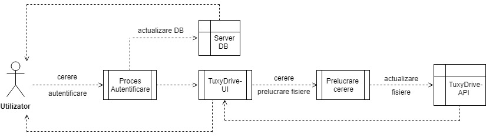
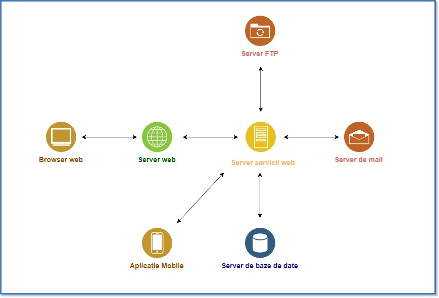
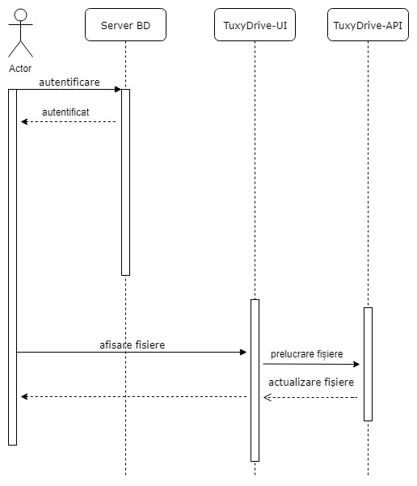
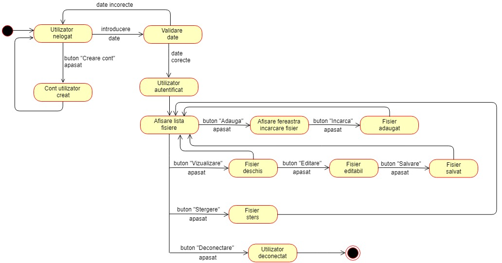

# TuxyDrive
## Membrii echipei
   Teona-Stefana Rusu: Team Leader
    Ioana-Roxana Pomirleanu 
    Mariana Tucaliuc
## Prezentarea temei alese și motivația alegerii temei

TuxyDrive este o locație sigură unde utilizatorul poate stoca și accesa diferite fișiere de pe orice dispozitiv electronic (smartphone, tableta sau calculator). 
Am ales sa realizăm aceasta aplicație din necesitatea unui spațiu mai mare de stocare. De asemenea, stocarea într-o aplicație externă este eficientă pentru a realiza un back-up al datelor personale.

## Analiza tipurilor de aplicaţii existente

La ora actuală există multe servicii de stocare în cloud pe piață, cum ar fi: GoogleDrive, OneDrive, Dropbox, ICloud Drive. 
Spre deosebire de aplicațiile existente, proiectul nostru dorește să intre în comunitatea open-source cu scopul de a permite utilizatorilor să contribuie cu ideile proprii la dezvoltarea aplicației, în funcție de necesități. 

## Descrierea generală a implementării 

Aplicația **TuxyDrive** va oferi utilizatorilor posibilitatea de a stoca și gestiona o serie de fișiere într-o manieră cât mai facilă.
Utilizatorii vor putea să își stocheze fișierele și să le organizeze într-o structură ierarhică. De asemenea, aceștia vor avea posibilitatea de a partaja documente cu alți utilizatori ai platformei.

TuxyDrive va conține două mari componente:

- **TuxyDrive-UI** -- interfața grafică ce îi va expune utilizatorului uneltele necesare pentru a gestiona fișierele personale.
    - aceasta va fi implementată folosind *HTML5*, *CSS3* și *JavaScript* pentru a consuma datele expuse de **TuxyDrive-API**.
- **TuxyDrive-API** -- serviciu web implementat folosind paradigma REST ce va oferi posibilitatea clienților să efectueze acțiuni legate de gestiunea fișierelor într-o manieră programatică -- serviciul web va fi compus din următoarele endpoint-uri:
    - `/v1/user/{user_id}`
        - resursa */user* gestionează informații despre utilizator și despre resursele *drive* deținute de acesta.
        - accesul la această resursă va fi restricționat 
    - `/v1/drives/{drive_id}`
        - resursa *drive* gestionează informații despre fișierele stocate în cadrul aplicației și despre modul în care sunt organizate -- o resursă drive va conține o serie de referințe către resurse de tip *tree* sau *blob* deținute de către un utilizator sau un grup de utilizatori.
    - `/v1/tree/{tree_id}`
        - resursa *drive* va gestiona modul în care resursele de tip *blob* sunt organizate, oferind posibilitatea clientului de a stoca fișiere într-o structură arborescentă.
    - `/v1/blob/{blob_id}`
        - resursa *blob* va gestiona conținutul brut al unui fișier stocat în TuxyDrive

Pentru că interfața aplicației este decuplată de serviciile web avem posibilitatea de a dezvolta mult mai ușor aplicații desktop sau mobile care să ofere aceleași funcționalități consumând informațiile expuse de serviciile web.

## Resursele hardware/software utilizate 

Resursele hardware  și  software utilizate pentru crearea aplicației sunt:
 - Laptop/Desktop
 - Eclipse Oxygen -- pentru dezvoltarea scripturilor 
 - Server care folosește servicii web de tip REST
 - Server web(Servlet)
 - Server de baze de date (MySQL)
 - GitHub -- pentru managmentul proiectului
 - StackEdit -- pentru editarea documentației 

## Identificarea actorilor și a componentelor principale 

Aplicația **TuxyDrive** are ca și componente principale un *server de servicii web*, un *server web* și un *server de baze de date*. Pe lângă acestea, un *server FTP* este utilizat pentru gestionarea fișierelor și un *server de email* este utilizat pentru trimiterea de mesaje către utilizator. O componentă separată va fi *aplicația mobile*.

Singurii actori care vor interacționa cu aplicația vor fi *utilizatorii*.

## Diagrama UML de use-case 
## Diagrama UML de information flow 

Diagrama Information Flow evidențiază fluxul informației de la utilizator către serviciile implementate de  TuxyDrive-API. Utilizatorul înaintează o cerere de autentificare. În cazul în care contul introdus nu există, utilizatorul își poate crea unul, iar datele introduse sunt salvate în baza de date ce gestionează conturile de utilizator. După autentificare, utilizatorul are posibilitatea de a adăuga un fișier nou sau de a efectua anumite operații asupra fișierelor existente, în urma cărora se va face un update folder-ului cu fisiere.

## Diagrama UML de componente

Aplicația **TuxyDrive** va folosi un server de servicii web de tip REST pentru a interacționa cu un server web (Servlet) și un server de baze de date. De asemenea, vom folosi un server FTP pentru gestionarea fișierelor și un server de email pentru trimiterea de mesaje către utilizator.
*Opțional*: Aplicația va fi accesibilă și pentru mobile. 

## Diagrama UML de activitate 
## Diagrama UML de secvență 

Diagrama de secvență evidențiază modul în care utilizatorul interacționează cu componentele aplicației **TuxyDrive** în funcție de acțiunile pe care le desfășoară: autentificare, vizualizarea fișierelor existente, adăugarea unui fișier, editarea sau ștergerea unui fișier existent.

## Diagrama UML de stare 

Diagrama de stare surprinde stările prin care trece aplicația **TuxyDrive** atunci când este accesată de utilizator pentru crearea unui cont, autentificare, adăugarea unui fișier nou, editarea, vizualizarea și ștergerea unui fișier existent. 

## Diagrama ER pentru baza de date