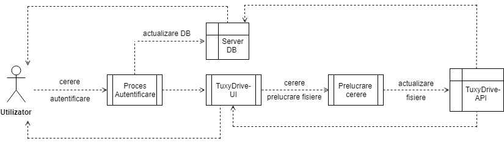

# TuxyDrive
## Membrii echipei
 
Teona-Ștefana Rusu: Team Leader 

Ioana-Roxana Pomîrleanu

Mariana Tucaliuc

## Prezentarea temei alese și motivația alegerii temei

TuxyDrive este o locație sigură unde există posibilitatea de a stoca fișiere online, astfel încât acestea să fie accesibile de pe mai multe dispozitive din orice locație. Am ales să implementăm această aplicație din necesitatea unui spațiu mai mare de stocare. În loc să ne stocăm datele pe PC, tabletă, telefon sau laptop, acestea vor fi stocate în TuxyDrive pentru a le păstra fără a achiziționa elemente hardware scumpe. Totodată stocarea fișierelor în TuxyDrive este o măsură de sigurantă împotriva pierderii acestora.

## Analiza tipurilor de aplicaţii existente

La ora actuală, numărul provider-ilor de cloud storage este într-o creştere continuă, iar serviciile specializate în stocarea în cloud includ aplicaţii software precum GoogleDrive, OneDrive, Dropbox, Google Docs, ICloud Drive etc. Indiferent că este vorba despre documente, clipuri video sau fotografii, principiul rămâne acelaşi: serviciile online permit utilizatorilor să uploadeze informaţii pe servere, unde vor putea fi accesate din orice locaţie prin conexiunea la Internet.

Spre deosebire de aplicațiile existente, proiectul nostru dorește să intre în comunitatea open-source cu scopul de a permite utilizatorilor să contribuie cu ideile proprii la dezvoltarea aplicației, în funcție de necesități.

## Descrierea generală a implementării 

Aplicația **TuxyDrive** va oferi utilizatorilor posibilitatea de a stoca și gestiona o serie de fișiere într-o manieră cât mai facilă.
Utilizatorii vor putea să își stocheze fișierele și să le organizeze într-o structură ierarhică. De asemenea, aceștia vor avea posibilitatea de a partaja documente cu alți utilizatori ai platformei.

TuxyDrive va conține două mari componente:

- **TuxyDrive-UI** -- interfața grafică ce îi va expune utilizatorului uneltele necesare pentru a gestiona fișierele personale.
    - aceasta va fi implementată folosind *HTML5*, *CSS3* și *JavaScript* pentru a consuma datele expuse de **TuxyDrive-API**.
- **TuxyDrive-API** -- serviciu web implementat folosind paradigma REST ce va oferi posibilitatea clienților să efectueze acțiuni legate de gestiunea fișierelor într-o manieră programatică -- serviciul web va fi compus din următoarele endpoint-uri:
    - `/v1/user/{user_id}`
        - resursa */user* gestionează informații despre utilizator și despre resursele *drive* deținute de acesta.
        - accesul la această resursă va fi restricționat 
    - `/v1/drives/{drive_id}`
        - resursa *drive* gestionează informații despre fișierele stocate în cadrul aplicației și despre modul în care sunt organizate -- o resursă drive va conține o serie de referințe către resurse de tip *tree* sau *blob* deținute de către un utilizator sau un grup de utilizatori.
    - `/v1/tree/{tree_id}`
        - resursa *tree* va gestiona modul în care resursele de tip *blob* sunt organizate, oferind posibilitatea clientului de a stoca fișiere într-o structură arborescentă.
    - `/v1/blob/{blob_id}`
        - resursa *blob* va gestiona conținutul brut al unui fișier stocat în TuxyDrive

Pentru că interfața aplicației este decuplată de serviciile web, avem posibilitatea de a dezvolta mult mai ușor aplicații desktop sau mobile care să ofere aceleași funcționalități, consumând informațiile expuse de serviciile web.

## Resursele hardware/software utilizate 

Resursele hardware și software utilizate pentru dezvoltarea aplicației sunt:
- Laptop/Desktop;
- Sistem de operare: Windows;
- Browser: Mozilla Firefox, Google Chrome;
- Eclipse Oxygen;
- Sublime Text;
- Server care folosește servicii web de tip REST;
- Server web(Servlet);
- Server pentru baza de date (MySQL);
- Spring -- Java Framework;
- StackEdit -- folosit pentru editarea documentației;
- draw.io -- software folosit pentru crearea diagramelor UML și ER;
- Git -- sistem de versionare folosit pentru managmentul proiectului; 

## Identificarea actorilor și a componentelor principale 

Aplicația **TuxyDrive** are ca și componente principale un *server de servicii web*, un *server web* și un *server de baze de date*. Pe lângă acestea, un *server FTP* este utilizat pentru gestionarea fișierelor și un *server de email* este utilizat pentru trimiterea de mesaje către utilizator. O componentă separată va fi *aplicația mobile*.

Singurii actori care vor interacționa cu aplicația vor fi *utilizatorii*.

## Diagrama UML de use-case 

Diagrama use-case oferă o descriere generală a modului în care va fi utilizat TuxyDrive, furnizează o privire de ansamblu a funcționalităților ce se doresc a fi oferite și arată cum interacționează aplicația cu utilizatorul.

## Diagrama UML de information flow 

Diagrama Information Flow evidențiază fluxul informației de la utilizator către serviciile implementate de TuxyDrive-API. Utilizatorul înaintează o cerere de autentificare. În cazul în care utilizatorul nu are creat un cont , acesta își poate crea unul, iar datele introduse vor fi salvate în baza de date. După autentificare, utilizatorul are posibilitatea de a adăuga un fișier nou sau de a efectua anumite operații asupra fișierelor existente, în urma cărora se va actualiza baza de date.

## Diagrama UML de componente

Aplicația **TuxyDrive** va folosi un server de servicii web de tip REST pentru a interacționa cu un server web (Servlet) și un server de baze de date. De asemenea, vom folosi un server FTP pentru gestionarea fișierelor și un server de email pentru trimiterea de mesaje către utilizator.

*Opțional*: Aplicația va fi accesibilă și pentru mobile. 

## Diagrama UML de activitate 

Diagrama de activitate descrie execuția unor acțiuni desfășurate fie pe parcursul utilizării, fie la apariția unor evenimente. Prin diagrama de activitate este evidențiat un scenariu al utilizării aplicației și al modului în care TuxyDrive reacționează la comenzile utilizatorului.

## Diagrama UML de secvență 

Diagrama de secvență evidențiază modul în care utilizatorul interacționează cu componentele aplicației **TuxyDrive** în funcție de acțiunile pe care le desfășoară: autentificare și prelucrare de fișiere.

## Diagrama UML de stare 

Diagrama de stare surprinde stările prin care trece aplicația **TuxyDrive** atunci când este accesată de utilizator pentru crearea unui cont, autentificare, adăugarea unui fișier nou, editarea, vizualizarea sau ștergerea unui fișier existent. 

## Diagrama ER pentru baza de date

O diagramă a relației entitate (ERD) prezintă relațiile dintre entitățile stocate într-o bază de date. O entitate în acest context este o componentă a datelor. Cu alte cuvinte, diagramele ER ilustrează structura logică a bazelor de date.  
În aplicația TuxyDrive este implementată o bază de date cu trei tabele, două pentru utilizator și una pentru fișiere. Din tabelele destinate clienților un tabel conține datele preluate din formularul de autentificare și unul conține numele de utilizator și parola. În tabelul cu fișiere sunt adăugate/șterse/modificate fișierele corespunzătoare fiecărui utilizator.  
Un utilizator poate deține unul sau mai multe fișiere din tabelul cu fișiere (relație one to many) precum și un singur nume de utilizator (relație one to one).  

## Analiza dezvoltării aplicației în etapa II

Pe parcursul etapei II a proiectului s-au pus bazele atât pentru **TuxyDrive-UI**, cât și pentru **TuxyDrive-API**.

 - TuxyDrive-UI
 
     - [ ] Utilizând *HTML5*, *CSS3* și *JavaScript* s-au dezvoltat paginile:
        - index (prima pagină a aplicației);
        - login (conține un formular care permite utilizatorului să se logheze, înaintând o cerere către servlet);
        - home;
     - [ ] Pagina de _logout_ a fost creată cu ajutorul un server web care folosește jsp-uri, realizându-se procesul de delogare.
             

     
 - TuxyDrive-API
     
     - Server web care folosește servlet
          - acesta primește cererea de autentificare înaintată de utilizator atunci când dorește să se logheze;
          - servletul, la rândul său, trimite o cerere către serverul de servicii web; 
          - în cazul în care primește un răspuns afirmativ (status 200), clientul este redirecționat către pagina home a aplicației.
                 
     - Server de servicii web
          - asigură comunicarea dintre servlet și baza de date
          - serverul de servicii web primește o cerere de la servlet, apoi înaintează o cerere de verificare a existenței utilizatorului în baza de date către DBManager și așteaptă un răspuns;
          - în cazul în care primește un răspuns afirmativ, trimite către servlet un răspuns în format JSON care conține datele utilizatorului.

     - Baza de date
          -  serverul de mysql comunică cu aplicația cu ajutorul driver-ului JDBC-Java_Database_Connectivity;
          -  este creat un tabel în baza de date în care s-a realizat o operație de căutare a numelui și a parolei introduse de către utilizator;
          - atunci când primește 

## Obiectivele etapei III

 - TuxyDrive-UI
     - Realizarea unei pagini html care să permită utilizatorului crearea unui cont;
     - Dezvoltarea paginii _home_ astfel încât să permită utilizatorului să vizualizeze lista fișierelor

 - TuxyDrive-API
     - Server web care folosește servlet
        - afișează fișierele utilizatorului prin intermediul JSP-ului
        - adaugă funcționalități: adăugare, editare, vizualizare, ștergere

     - Server de servicii web
        - adăugare FTP pentru a gestiona fișierele

     - Baza de date
          - crearea  tabelelor autentificare și fișiere utilizator;
          - implementarea operațiilor de adăugare, ștergere, căutare, modificare entități din baza de date TuxyDrive.

 - _Opțional_: Aplicație Mobile

## Analiza dezvoltării aplicației în etapa III

1. Probleme speciale sau dificultăți întâmpinate:
- încărcarea fișierelor în interfață
- realizarea legăturii între servlet și serverul web
- crearea funcțiilor de vizualizare și ștergere a fișierelor în JavaScript

2. Design pattern:
- MVC (Model-View-Controller)

3. Contribuțiile membrilor echipei:

  a) Rusu Teona-Ștefana:
    - crearea structurii proiectului în Eclipse
    - identificarea actorilor și a componentelor aplicației
    - descrierea implementării
    - diagrama UML de componente
    - diagrama UML de Secvență
    - implementarea serverului de servicii web pentru logare
    - implementarea serverului de servicii web pentru managementul fișierelor
    - crearea paginii de wiki
    
  b) Pomîrleanu Ioana-Roxana:
    - adăugare resurse hardware și software în documentație
    - diagrama UML de Information Flow
    - diagrama UML de Stare
    - implementare servlet pentru logare
    - implementare jsp pentru logare
    - implementare servlet pentru înregistrare utilizator nou
    - implementare jsp pentru înregistrare utilizator nou

  c) Tucaliuc Mariana:
    - diagrama UML de Use-Case
    - diagrama UNL de Activitate
    - diagrama ER
    - implementare conexiunii bazei de date cu serverul
    - creare tabelă pentru autentificare
    - creare tabelă pentru utizilator
    - creare tabelă pentru fișiere

4. Aprecierea critică a membrilor echipei:

  a) Teona: Demersul proiectului a fost unul progresiv. Toți membrii echipei au fost foarte implicați în rezolvarea task-urilor. De asemenea, au fost dispuși să împărtășească din propriile cunoștințe implicându-se prin review la contribuțiile celorlați membri la proiect.
  
  b) Roxana: Pe parcursul implementării proiectului, Teona a demonstrat că este un bun lider, reușind să își păstreze calmul și să ia deciziile corecte cu privire la dezvoltarea aplicației în momentele critice. Ne-a ajutat și îndrumat cu succes în realizarea task-urilor pe care, încă de la început, le-a împărțit în mod echilibrat între membrii echipei.
  
  c) Mariana: Teona și-a asumat în totalitate rolul de lider. A împărțit task-urile în mod egal, în funcție de cunoștiințele noastre și a sărit în ajutor de fiecare dată când a apărut vreo problemă.

5. Concluzii:
  - aplicația permite utilizatorului să stocheze fișiere în cloud
  - este disponibilă și versiunea Desktop

6. Modalități de extindere:
  - posibilitatea de a modifica documente online
  - aplicație mobile

7. Bibliografie:
  - https://studenti.h23.ro
  - https://stackoverflow.com