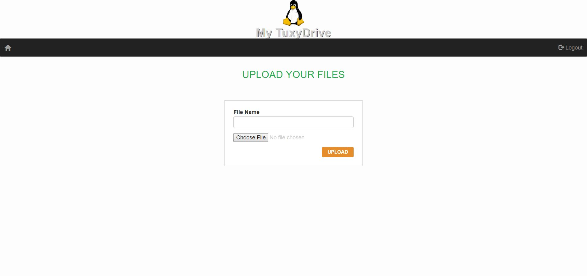

# TuxyDrive

## Prima pagină

Această pagină prezintă utilizatorului o scurtă descriere despre aplicația TuxyDrive.
În colțul din dreapta sus se pot observa două butoane: unul pentru Logare (în cazul în care utilizatorul are deja un cont în aplicație) și unul pentru Înregistrare (în cazul în care este un utilizator nou).

## Înregistrare

La apăsarea butonului **Sign Up** este afișată o pagină în care noul utilizator trebuie să-și introducă datele. În continuare va trebui să se logheze în pagina de _Login_, prezentată în continuare.

## Log in

La apăsarea butonului de **Login** este afișată o nouă pagină. Utilizatorul, deja existent, trebuie să introducă _username_ și _parola_.

## Homepage

După logarea cu succes a utilizatorului este afișată pagina cu fișierele existente.

## Adaugă fișier

De asemenea, în pagina de _home_ există butonul de **Add** care oferă posibilitatea utilizatorului de a adăuga alte fișiere în baza de date.

